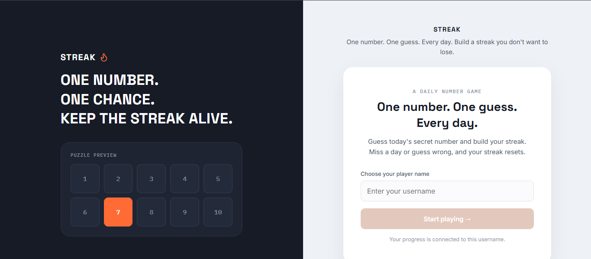
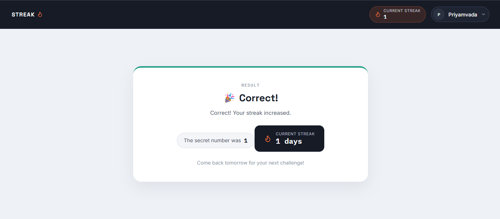
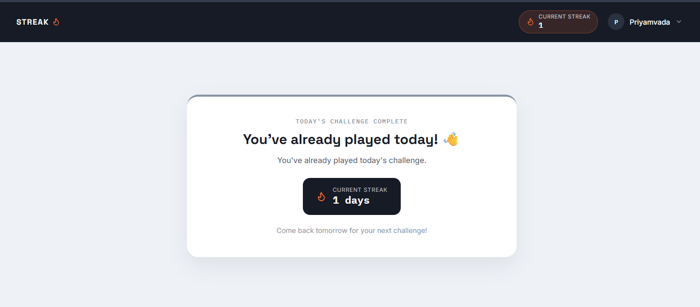

<div align="center">

#  STREAK

### One number. One guess. Every day.

A full-stack daily number guessing game where players get one chance to guess the secret number and build their streak.

<br />


</div>

---

## About

**STREAK** is a daily number guessing game.

Each player gets one guess for the day's challenge. If the guess is correct, their streak increases. If the guess is incorrect or the player misses their daily challenge, the streak resets according to the game logic.

The game stores player progress using usernames and prevents players from playing the same daily challenge multiple times.

---

## Features

- Daily number challenge
- One guess per player per day
- Streak tracking
- Correct and incorrect result handling
- Already played detection
- Player profile dropdown
- Player statistics including streak and last played date
- Responsive user interface
- Persistent player data using MongoDB

---

## Screenshots

### Welcome Screen

The landing page includes a puzzle preview, game information, and a username input to start playing.



### Correct Guess

When the player guesses correctly, the result screen displays the secret number and the updated streak.



### Already Played

Players cannot submit another guess after completing the challenge for the day.



---

## Tech Stack

### Frontend

- React
- Vite
- CSS

### Backend

- Node.js
- Express.js
- MongoDB
- Mongoose

### Deployment

- Frontend: Vercel
- Backend: Render
- Database: MongoDB

Frontend: https://streak-game-p078.vercel.app/
Backend: https://streak-game-txro.onrender.com
---

## Project Structure

```text
streak-game/
│
├── client/
│   ├── src/
│   │   ├── components/
│   │   ├── services/
│   │   ├── App.jsx
│   │   └── index.css
│   └── package.json
│
├── server/
│   ├── config/
│   ├── models/
│   ├── routes/
│   ├── server.js
│   └── package.json
│
└── README.md